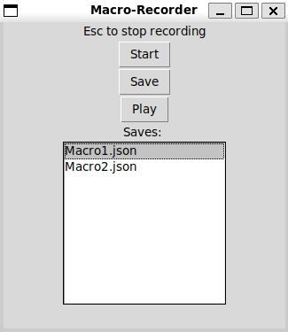

# Macro

A simple Python GUI to record, save, and run keyboard macros.

<p align="center">
  
</p>

## Features

* ⌨️ Record keyboard input
* 💾 Save and load macros
* 🔁 Replay macros with timing
* 🖱️ Minimal interface (corporate slang for uses tkinter)

## Installation

Install the required package:

```bash
pip install -r requirements.txt
```

> `tkinter` is required but comes preinstalled with most Python distributions.
> On Linux, you may need to install it manually (e.g., `sudo apt install python3-tk`).

## Usage

```bash
python main.py
```

---
